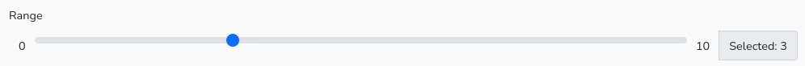

# FormsBootstrap

[By Sébastien L'haire](http://sebastien.lhaire.org)

A Laravel library to generate forms based on Laravel Collective [Forms & HTML](https://laravelcollective.com/docs/6.0/html), [Boostrap](https://getbootstrap.com/) 5 CSS Framework. RichText editor, and  Icons provided by [FontAwesome](https://fontawesome.com/). Manages also results inputs of packages [DateRangePickerHelper](https://github.com/seblhaire/daterangepickerhelper), [Uploader](https://github.com/seblhaire/uploader), and [Tags input](https://github.com/seblhaire/tagsinput). Package demo available [here](https://sebastien.lhaire.org/formsbootstrap). Includes form management and validation.


# Installation

1. install package

`composer require seblhaire/formsbootstrap`
See package documentations if you want to use related packages DateRangePickerHelper, Uploader and Tagsinput.

2.  Composer will automatically link the package with Laravel. But you still can explicitely add provider and facade to your `config/app.php`:
```php
'providers' => [
	Collective\Html\HtmlServiceProvider::class,
	Seblhaire\FormsBootstrap\FormsBootstrapServiceProvider::class,
]
```

3. Publish package (optionally).
``` sh
$ php artisan vendor:publish
```

4. For Javascript and stylesheets, see next section.

# Javascript and stylesheets

On a webpage, every JS library and CSS stylesheets can be linked separately. If you choose this classical way, first dowload and install jQuery and Bootstrap. Then publish package files as explained above and put following tags in your template:

```html
<script type="text/javascript" src="formsbootstrap/js/jquery.richtext.js"></script>
<script type="text/javascript" src="formsbootstrap/js/seb.formsbootstrap.js"></script>
```
Websites often use many libraries and stylesheets and browser must download many files before the site can be rendered properly. Modern websites come with a single compressed Javascript file which concatenates necessary scripts; same principle for stylesheets. With Laravel you can use [Laravel Mix](https://github.com/JeffreyWay/laravel-mix) to compile files.

Use [NPM](https://www.npmjs.com/) package manager :
`npm install bootstrap jquery @fortawesome/fontawesome-free`

Then your js source file should be something like this:

```js
global.jQuery = require('jquery');
var $ = global.jQuery;
var jQuery = global.JQuery;
window.$ = $;
window.jQuery = jQuery;
require('bootstrap');
require('../../vendor/seblhaire/formsbootstrap/resources/js/seb.formsbootstrap.js');
require('../../vendor/seblhaire/formsbootstrap/resources/js/jquery.richtext.js');
```
For your stylesheet:

```css
@import '~bootstrap/scss/bootstrap';
@import "~@fortawesome/fontawesome-free/scss/fontawesome";
@import "~@fortawesome/fontawesome-free/scss/regular";
@import "~@fortawesome/fontawesome-free/scss/solid";
@import "~@fortawesome/fontawesome-free/scss/brands";
@import "../../vendor/seblhaire/formsbootstrap/resources/css/formsbootstrap";
@import "../../vendor/seblhaire/formsbootstrap/resources/css/richtext";
```
# Config files

Accessible through

```php
config('formsbootstrap')
```

Section `formsbootstrap.classes` contains class selectors that will be used for form validation etc. Section `formsbootstrap.mandatory` gives mandatory parameters for each form tag. Section `formsbootstrap.editorTranslations` contains translations for RichTextEditor. Finally section `formsbootstrap.defaults` contains default tag parameters.

In case you need change defaut values, use command `php artisan vendor:publish` and chose appropriate package in list. Then config files will be available in file `config/vendor/seblhaire/`.


# Form tags

Templates have been defined in order to build forms rapidly in Laravel Blade templates. Example can be found in above mentionned demo site. The command that buils `<form>` tag is described in last subsection.

## INPUT HIDDEN
```php
Form::bsHidden(array $data)
```

### Parameters:
* `data`: array parameter. Content:
	* `id`: **mandatory** id of field.
	* `value`: **mandatory** string or numeral values.
	* `name`: name of field, if different from id.
	* `attributes`: array of values to be added to input.

## INPUT TEXT

```php
Forms::bsText(array $data)
```

### Parameters

* `data`: array parameter. Content:
  * `id`: **mandatory** id of input.
  * `labeltext`: **mandatory** label of input.
	* `name`: name of field, if different from id.
  * `value`: prefilled value in input. Default `null`.
  * `required`: the input must be filled to validate form. Default `false`.
  * `input_in_div`: sets if label and input should be contained in a `<div>`. Default `true`.
  * `divclass`: class to be added to div tag containing label and input. Default: `"mb-3"`. Not useful if parameter `input_in_div` is false.
  * `helptext`: text to help, to be inserted above field. Default: empty string.
  * `inputclass`: class of input tag. Default `"form-control"`.
  * `labelclass`: class of label tag. Default `"form-label"`.
  * `attributes`: array of input tag attributes to be added to default ones, Default: empty array.
  * `labelattributes`: array of label tag attributes to be added to default ones. Default: empty array.
  * `invalid-feedback`: text to be displayed if mandatory input is not filled. Default: translation key `formsbootstrap::messages.required`: "This field is required". Text can be string or translation key.  Cf [below](#translation_keys).
  * `valid-feedback`: text to be displayed if mandatory input is filled. Default: empty string.

### Example

`{!! Form::bsText(['id' => 'title', 'labeltext' => 'Title', 'required' => true]) !!}`


## TEXTAREA

```php
Forms::bsTextarea(array $data)
```

### Parameters

* `data`: array parameter. Content:
  * `id`: **mandatory** id of input.
  * `labeltext`: **mandatory** label of input.
	* `name`: name of field, if different from id.
  * `value`: prefilled value in input. Default `null`.
  * `required`: the input must be filled to validate form. Default `false`.
  * `input_in_div`: sets if label and input should be contained in a `<div>`. Default `true`.
  * `divclass`: class to be added to div tag containing label and input. Default: `"mb-3"`. Not useful if parameter `input_in_div` is false.
  * `helptext`: text to help, to be inserted above field. Default: empty string.
  * `inputclass`: class of input tag. Default `"form-control"`.
  * `labelclass`: class of label tag. Default `"form-label"`.
  * `attributes`: array of input tag attributes to be added to default ones, Default: empty array.
  * `labelattributes`: array of label tag attributes to be added to default ones. Default: empty array.
  * `invalid-feedback`: text to be displayed if mandatory input is not filled. Default: translation key `formsbootstrap::messages.required`: "This field is required". Text can be string or translation key.  Cf [below](#translation_keys).
  * `valid-feedback`: text to be displayed if mandatory input is filled. Default: empty string.

### Example

`{!! Form::bsTextarea(['id' => 'notes', 'labeltext' =>  'Notes', 'required' => true]) !!}`


## Editor
```php
Forms::bsEditor(array $data)
```
### Parameters

* `data`: array parameter. Content:
  * `id`: **mandatory** id of input.
  * `labeltext`: **mandatory** label of input.
	* `name`: name of field, if different from id.
  * `value` : text to display in editor. Default: `null`.
  * `required`: the input must be filled to validate form. Default `false`.
  * `helptext`: text to help, to be inserted above field. Default: empty string.
  * `inputclass`: class of input tag. Default `"form-control"`.
  * `labelclass`: class of label tag. Default `"form-label"`.
  * `attributes`: array of input tag attributes to be added to default ones, Default: empty array.
  * `labelattributes`: array of label tag attributes to be added to default ones. Default: empty array.
  * `invalid-feedback`: text to be displayed if mandatory input is not filled. Default: translation key `formsbootstrap::messages.required`: "This field is required". Text can be string or translation key.  Cf [below](#translation_keys).
  * `valid-feedback`: text to be displayed if mandatory input is filled. Default: empty string.
  * `divclass`: class to be added to div tag containing label and input. Default: `"mb-3"`.
  * `config`: array of Javascript editor parameters (Cf. next paragraph).
  * `configvar`: Javascript variable to initialize several editors (Cf. next paragraph).
  * `translations`: array of translations.

### Editor config

RichTextEditor can be parametrized by above config values. Editor can be initialized by several ways:
 * use `configvar` with a variable name, which contains a Javascript config variable:
 ```js
 <script type="text/javascript">
  var editorConfig = {!! FormsBootstrapUtils::validateEditorParams([
	  'imageUpload' => false,
	  'fileUpload' => false,
	  'fonts' => false
  ],[
	  'linkText' => 'Link content'
]) !!};
</script>
```
Default value is `null`
 * use `config` parameter. Default:
 ```js
 'config' => [
          'useParagraph' => true,
          'imageUpload' => false,
          'fileUpload' => false,
        ]
```
* if both `config` and  `configvar`  have `null` value, then editor is filled with default values and text in English.
#### Text formatting
* `bold`:  default: true
* `italic` : default: true
* `underline`: default: true
#### Text alignment

* `leftAlign`: default true
* `centerAlign`: default true
* `rightAlign`: default true
* `justify` : default true

#### Lists

* `ol` : default true
*  `ul` : default true

#### Title

* `heading` : default true

#### Fonts

*  `fontColor`: default true
* `fontSize` : default true
* `fonts` : default true
* `fontList` : array containing values:
  * Arial
  * Arial Black
  * Comic Sans MS
  * Courier New
  * Geneva
  * Georgia
  * Helvetica
  * Impact
  * Lucida Console
  * Tahoma
  * Times New Roman
  * Verdana

#### Uploads

Better use [Uploader](https://github.com/seblhaire/uploader)

* `imageUpload` : default false
* `fileUpload` : default false

#### Media

 * `videoEmbed` : default true

#### Link

* `urls` : default true

#### Tables

* `table`: default true

#### Code

* `removeStyles`: default  true,
* `code`:  default true

#### Colors

* `colors` array of colors. Default: empty array

#### Dropdowns

* `fileHTML` Default: empty string
* `imageHTML` Default: empty string

#### Privacy

* `youtubeCookies` : default true.

#### Developer settings

* `useSingleQuotes`: default false
* `height` Default: 0,
* `heightPercentage`: Default 0
* `id`: default empry string
* `class`: default empty string
* `useParagraph` : default false
* `maxlength`: default 0
* `callback` default null
* `useTabForNext`: default false

 #### Translations

 * `translations`: array of translations. Replace default translations by using keys in list above. Default value are defined in `config('formsbootstrap.editorTranslations')`. Default texts are listed next to keys. Text can be string or translation key. Cf [below](#translation_keys).
   * `title` : `formsbootstrap::editor.title` "Title"
   * `white` : `formsbootstrap::editor.white` "White"
   * `black` : `formsbootstrap::editor.black` "Black"
   * `brown` : `formsbootstrap::editor.brown` "Brown"
   * `beige`: `formsbootstrap::editor.beige` "Beige"
   * `darkBlue`: `formsbootstrap::editor.darkBlue` "Dark Blue"
   * `blue`: `formsbootstrap::editor.blue` "Blue"
   * `lightBlue` : `formsbootstrap::editor.lightBlue` "Light Blue"
   * `darkRed`: `formsbootstrap::editor.darkRed` "Dark Red',
   * `red` : `formsbootstrap::editor.red` "Red"
   * `darkGreen` : `formsbootstrap::editor.darkGreen` "Dark Green"
   * `green` : `formsbootstrap::editor.green` "Green"
   * `purple` : `formsbootstrap::editor.purple` "Purple"
   * `darkTurquois`: `formsbootstrap::editor.darkTurquois` "Dark Turquois"
   * `turquois` : `formsbootstrap::editor.turquois` "Turquois"
   * `darkOrange`: `formsbootstrap::editor.darkOrange` "Dark Orange"
   * `orange`: `formsbootstrap::editor.orange` "Orange"
   * `yellow`: `formsbootstrap::editor.yellow` "Yellow"
   * `imageURL`: `formsbootstrap::editor.imageURL` "Image URL"
   * `fileURL`: `formsbootstrap::editor.fileURL` "File URL"
   * `linkText`: `formsbootstrap::editor.linkText` "Link text"
   * `url` : `formsbootstrap::editor.url` "URL"
   * `size` : `formsbootstrap::editor.size` "Size"
   * `responsive` : `formsbootstrap::editor.responsive` "Responsive"
   * `text` : `formsbootstrap::editor.text` "Text"
   * `openIn`: `formsbootstrap::editor.openIn` "Open in"
   * `sameTab` : `formsbootstrap::editor.sameTab` "Same tab"
   * `newTab` : `formsbootstrap::editor.newTab` "New tab"
   * `align`: `formsbootstrap::editor.align` "Align"
   * `left` : `formsbootstrap::editor.left` "Left"
   * `center`: `formsbootstrap::editor.center` "Center"
   * `right` : `formsbootstrap::editor.right` "Right"
   * `rows` : `formsbootstrap::editor.rows` "Rows"
   * `columns` : `formsbootstrap::editor.columns` "Columns"
   * `add`: `formsbootstrap::editor.add` "Add"
   * `pleaseEnterURL`: `formsbootstrap::editor.pleaseEnterURL` "Please enter an URL"
   * `videoURLnotSupported` : `formsbootstrap::editor.videoURLnotSupported` "Video URL not supported"
   * `pleaseSelectImage` : `formsbootstrap::editor.pleaseSelectImage` "Please select an image"
   * `pleaseSelectFile` : `formsbootstrap::editor.pleaseSelectFile` "Please select a file"
   * `bold` : `formsbootstrap::editor.bold` "Bold"
   * `italic` : `formsbootstrap::editor.italic` "Italic"
   * `underline` : `formsbootstrap::editor.underline` "Underline"
   * `alignLeft` : `formsbootstrap::editor.alignLeft` "Align left"
   * `alignCenter`: `formsbootstrap::editor.alignCenter` "Align centered"
   * `alignRight` : `formsbootstrap::editor.alignRight` "Align right"
   * `addOrderedList` : `formsbootstrap::editor.addOrderedList` "Add ordered list"
   * `addUnorderedList` : `formsbootstrap::editor.addUnorderedList` "Add unordered list"
   * `addHeading` : `formsbootstrap::editor.addHeading` "Add Heading/title"
   * `addFont` : `formsbootstrap::editor.addFont` "Add font"
   * `addFontColor`: `formsbootstrap::editor.addFontColor` "Add font color"
   * `addFontSize` : `formsbootstrap::editor.addFontSize` "Add font size"
   * `addImage`: `formsbootstrap::editor.addImage` "Add image"
   * `addVideo` : `formsbootstrap::editor.addVideo` "Add video"
   * `addFile`: `formsbootstrap::editor.addFile` "Add file'"
   * `addURL` : `formsbootstrap::editor.addURL` "Add URL"
   * `addTable` : `formsbootstrap::editor.addTable` "Add table"
   * `removeStyles` : `formsbootstrap::editor.removeStyles` "Remove styles"
   * `code` : `formsbootstrap::editor.code` "Show HTML code"
   * `undo` : `formsbootstrap::editor.undo` "Undo"
   * `redo` : `formsbootstrap::editor.redo` "Redo"
   * `close` : `formsbootstrap::editor.close` "Close"


### Example
```
Form::bsEditor(['id' => 'text', 'labeltext' => 'Text', 'value' => $content]);
```


## INPUT EMAIL

```php
Forms::bsEmail(array $data)
```

### Parameters


* `data`: array parameter. Content:
  * `id`: id of input. Default `"email"`.
	* `name`: name of field, if different from id.
  * `labeltext`:  label of input. Default, content of translation key `formsbootstrap::messages.email`: "E-mail". Text can be string or translation key.  Cf [below](#translation_keys).
  * `value`: prefilled value in input. Default `null`.
  * `required`: the input must be filled to validate form. Default `false`.
  * `verify`:  the email address format must be validated before the form is sent. Defaut: `true`. Cf [below](#Email_verification).
  * `input_in_div`: sets if label and input should be contained in a `<div>`. Default `true`.
  * `divclass`: class to be added to div tag containing label and input. Default: `"mb-3"`. Not useful if parameter `input_in_div` is false.
  * `helptext`: text to help, to be inserted above field. Default: empty string.
  * `inputclass`: class of input tag. Default `"form-control"`.
  * `labelclass`: class of label tag. Default `"form-label"`.
  * `attributes`: array of input tag attributes to be added to default ones, Default: empty array.
  * `labelattributes`: array of label tag attributes to be added to default ones. Default: empty array.
  * `invalid-feedback`: text to be displayed if mandatory input is not filled. Default: translation key `formsbootstrap::messages.required`: "This field is required". Cf [below](#translation_keys).
  * `valid-feedback`: text to be displayed if mandatory input is filled. Default: empty string.
  * `email_regex`: regular expression used to verify password. Cf [below](#Email_verification).

### Email verification

Email fields can be automatically verified by regular expression. This expression can be found in `config('formsbootstrap.defaults.email,email_regex')`. It only verifies that a valid email address is used, but not that a mailbox exists and that the person who entered it in the form is its legitimate user.

If you want to check that the user that sent the form has access to the address, we suggest the standard verification procedure that is currently used by web application: in your main code, send an email which contains a link to a callback function in your code. Then email address is validated since the user must have access to the mailbox to read the validation mail. Laravel provides [built-in services](https://laravel.com/docs/9.x/verification) to verify email addresses.

Besides, in the form processing controller method, you should validate the email address on server side. Use something like this:
```
$validator = Validator::make($request->all(), [
      'email' => ['string', 'regex:' . config('formsbootstrap.defaults.email.regex')],
]);
if ($validator->fails()){
  return response()->json(['res' => $validator->errors()->all()]);
}
```
Emails can also be validated by `'email' => 'required|string|email:rfc'`.

### Javascript object

With this package, we provide a simple Javascript object that will be used by form validation.  It is initalized automatically by our package.
```
jQuery('#email').sebEmailHelper({emailregex : /^ ... $/});
```
If you need validate your field in a function, just call

```
if (jQuery('#email').data('sebemailhelper').check()){
...
}
```
### Example
`{!! Form::bsEmail[) !!}`


## INPUT PASSWORD

Two tag methods are available.
* first method provides a simple `<input type="password">` and optionally validates password rules;
* second method outputs a complete password change procedure, with (optional) old password, new password and password confirmation.
	* two options also allow passwords to be displayed in clear and to generate a new password.
	* old password can be verified either by a special route called before main form is submitted, or in main route itself.

Default password rules are:
-   min. 8 characters and max. 80 characters
-   at least one lower case character and one upper case character
-   at least one number
-   at least one symbol character among ^!?-_§=@$£¢€&§°[]{}*#%/\.;,:+|()
```php
Form::bsPassword(array $data)
Form::bsPasswordWithConfirm(array $data)
```
### Common parameters to both methods
`config('formsbootstrap.defaults.password_common')`  contains options available for the two methods;

* `min_password` sets the minimal password length. Default is 8. This value is set by PHP constant `PASSWORD_MIN_LENGTH` contained in package config file, since this value is used in password validation regular expression and in other values  in the config file.
 * `max_password` sets the maximal password length. Default is 80. This value is set by PHP constant  `PASSWORD_MAX_LENGTH`, for the same reasons as `PASSWORD_MIN_LENGTH`.
 * `password_regex` contains Javascript regular expression for password validation.
 *  `password_regex_php` contains  PHP regular expression for password validation.
  *  `authorized_special_chars` contains the list of special chars authorized in passwords. NB: if you change this value, you must also modify the values in `password_regex` , `password_regex_php` and  `password_chars`.
 *  `password_chars` contains all characters authorized in passwords. NB: if you change this value, you must also modify the values in `password_regex` , `password_regex_php` and  `authorized_special_chars` .
 *  `invalid-feedback`: text to be displayed if mandatory input is not filled. Default: translation key `formsbootstrap::messages.required`: "This field is required". Cf [below](#translation_keys).
* `valid-feedback`: text to be displayed if mandatory input is filled. Default: empty string.
* `input_in_div`: sets if label and input should be contained in a `<div>`. Default `true`.
* `divclass`: class to be added to div tag containing label and input. Default: `"mb-3"`. Not useful if parameter `input_in_div` is false.


### Parameters of password alone
`config('formsbootstrap.defaults.password')`  contains options for the unique password field:
* `id`: field id. Default : `"password"`.
* `name`: name of field, if different from id.
* `labeltext`:  label of input. By default: translation key `formsbootstrap::messages.password`: "Password".   Cf [below](#translation_keys).
* `required`: the input must be filled to validate form. Default `false`.
*  `validate`: password must validate the password rules before the form is sent. Default `false`,
* `inputclass`: class of input tag. Default `"form-control"`.
* `labelclass`: class of label tag. Default `"form-label"`.
* `attributes`: array of input tag attributes to be added to default ones, Default: empty array.
* `labelattributes`: array of label tag attributes to be added to default ones. Default: empty array.


### Parameters of password with confirm
`config('formsbootstrap.defaults.password-with-confirm')`  contains options for the password validation group:
* `oldpass`: parameters for old password field. Content:
  * `id`: field id. Default: `"old_password"`.
	* `name`: name of field, if different from id.
  * `labeltext`:  label of input. By default, translation key `formsbootstrap::messages.old_password`: "Old password". Cf [below](#translation_keys).
  * `inputclass`: class of input tag. Default `"form-control"`.
  * `labelclass`: class of label tag. Default `"form-label"`.
  * `attributes`: array of input tag attributes to be added to default ones, Default: `['autocomplete' => "current-password"]` which is required by password vaults.
  * `labelattributes`: array of label tag attributes to be added to default ones. Default: empty array.
* `newpass`: parameters for new password field. Content:
  * `id`: field id. Default: `"password"`.
	* `name`: name of field, if different from id.
  * `labeltext`:  label of input. By default, translation key `formsbootstrap::messages.new_password`: "New password". Cf [below](#translation_keys).
  * `inputclass`: class of input tag. Default `"form-control"`.
  * `labelclass`: class of label tag. Default `"form-label"`.
  * `attributes`: array of input tag attributes to be added to default ones, Default: `['autocomplete' => "new-password"]`  which is required by password vaults.
  * `labelattributes`: array of label tag attributes to be added to default ones. Default: empty array.
* `newpassclear`: parameters for new password field in clear. Content:
  * `id`: field id. Default: `"password-clear"`.
	* `name`: name of field, if different from id.
  * `inputclass`: class of input tag. Default `"form-control"`.
  * `attributes`: array of input tag attributes to be added to default ones, Default: empty array.
* `confirmpass`: parameters for confirm password field. Content:
  * `id`: field id. Default: `"password_confirmation"`.
	* `name`: name of field, if different from id.
  * `labeltext`:  label of input. By default, translation key `formsbootstrap::messages.confirm_password`: "Confirm Password". Cf [below](#translation_keys).
  * `inputclass`: class of input tag. Default `"form-control"`.
  * `labelclass`: class of label tag. Default `"form-label"`.
  * `attributes`: array of input tag attributes to be added to default ones, Default: empty array.
  * `labelattributes`: array of label tag attributes to be added to default ones. Default: empty array.
* `pwdhiddenzone-id`: id of `<div>` containing the password hidden by dots. Default: `"password-hidden-div"`.
* `pwdclearzone-id`: id of `<div>` containing the password in clear. Default: `"password-clear-div"`.
* `show_old`: must show the field "old password". Default: `true`.
* `show_generate`: show the generate password button and the hide/show password button. Default `true`.
* `show_clear`: show the hide/show password button. Default: `true`. Value false works only
if `show_generate` option is also `false`.
* `show_rules` displays a button that opens a modal that displays password rules. Here are related options:
	* `showrulesbtntext` : text that is displayed when mouse is over button.  By default, translation key `formsbootstrap::messages.showrules`: "Show password rules". Cf [below](#translation_keys).
     * `password_rules_modal_head`: text used in password rules modal. By default, translation key `formsbootstrap::messages.password_rules`: 'Password rules'. Cf [below](#translation_keys).
     * `password_rules_intro` contains the text displayed in the modal before the rules list. Default translation key  `formsbootstrap::messages.password_rules_intro` "Password must contain:". Cf [below](#translation_keys).
    * `password_rules_list` is used for an array of strings that will be used to build a bulleted list of rules. Default: empty array. If array is empty, function `\Seblhaire\Formsbootstrap\FormsBootstrapUtils::complileRules()` builds an array of rules based on translation keys `formsbootstrap::messages.password_rule_length`, `password_rule_case` , `password_rule_number` and `password_rule_special_char` and config entries found in `config('formsbootstrap')`. Cf [below](#translation_keys).
     * `close_rules` is the text use  `formsbootstrap::messages.close_rules` Default "Close".  Cf [below](#translation_keys).
* `generated_pass_length`: length of password generated by "Generate password" button. Default: 12.
* `helptext`: text to help, to be inserted above field. Default: empty string.
* `pwdbtngroup-class`: class of inline buttons group in field "new-password". Default: `"input-group"`.
* `pwdbtn-class`: class of inline button in field "new-password". Default: `"input-group-append"`.
* `togglebtn-class`: class of hide/show buttons. Default: `"btn btn-info"`.
* `toggledbtn-title`: content of hide/show button to be displayed on mouse hover. Default: translation key `"formsbootstrap::messages.display_pwd"`: "Display password". Cf [below](#translation_keys).
* `toggledbtn-icon-on`: icon to button "show password". Default: `<i class="far fa-eye"></i>`. This icon is provided by Font Awesome package.
* `toggledbtn-icon-off`: icon to button "hide password". Default: `<i class="far fa-eye-slash"></i>`. This icon is provided by Font Awesome package
* `generatebtn-icon`: icon for "Generate password" button. Default `<i class="fa-solid fa-gears"></i>`.  This icon is provided by Font Awesome package
* `generatepwdbtn-class`: class of "Generate password" button. Default: `"btn btn-outline-secondary"`,
* `generatepwdbtn-lbl`: text of "Generate password" button. Default translation key: `formsbootstrap::messages.generate`: "Generate". Cf [below](#translation_keys).
* `generatepwdbtn-title`: title of "Generate password" button to be displayed on mouse hover. Default translation key: `formsbootstrap::messages.generate_long`: "Generate new password". Cf [below](#translation_keys).
* `oldpass-feedback` : feedback displayed on validation when old password is missing.  Default translation key: `formsbootstrap::messages.incorrectoldpass`: "Old password incorrect or empty". Cf [below](#translation_keys).
* `oldpass-validfeedback`: feedback displayed when old password is valid. Default: empty string.
* `invalid-feedback`: feedback displayed when password is invalid, i.e. it is rejected by validation regex. Default translation key: `formsbootstrap::messages.invalidpassword`: "Password is invalid or empty". Cf [below](#translation_keys).
* `nomatch-feedback`: feedback displayed when password and confirmation don't match or when confirmation is missing. Default translation key: `formsbootstrap::messages.nomatchpassword`, "Confirmation missing or does not match with password". Cf [below](#translation_keys).
* `nomatch-validfeedback`: feedback to be displayed if password matches with confirmation. Default: empty string,
 * `valid-feedback`: feedback to be displayed when all verifications have been passed.
 * `checkoldpassurl`: old password can either be validated in an ad-hoc route, or in the form processing method itself. Default is `null`. If you want the old password to be validated before submitting whole form and to alter password, set this option with a route that accepts POST method and returns json result. Password validity can be returned to our password processing class either:
	 * by using our standard callback method that checks values of two json values return by our route:
		 * `ok` must be `true` or `false` to assert that password verification has been completed or not.
		 *  `password_ok` must be `true` or `false` to assert that password is correct or not.
	* by defininingy your own function that verfies password and by setting `checkoldpass_callback` with its name. Eg:
		```js
				<script>
					var chkpass = function(res){
						return res.password_checked == 'done';
					}
				</script>
				```

 *  `'csrfrefreshroute`: route to refresh csrf in case of security error. Add this route in your project:
   ```
  Route::get('/refresh-csrf', function(){
      return csrf_token();
  })->name('refreshcsrf');
  ```

###  Javascript object
With this package, we provide a simple Javascript object that will be used by form validation.  It is initialized automatically by our package.
```
 jQuery('#password').sebPasswordHelper({
    passregex : ...,
    ...
 });
```
Object functions are called by input buttons or form validation but you can call them in other scripts:

* `jQuery('#password').data('sebpasswordhelper').generate()` fills inputs with a generated password that passes rules;
* `jQuery('#password').data('sebpasswordhelper').toggleInputs()`  toggles visibility or invisibility of new password;
* `jQuery('#password').data('sebpasswordhelper').clearpass()` empties password input(s);
* `jQuery('#password').data('sebpasswordhelper').checkStrength()`  verifies if new password passes rules;
*  `jQuery('#password').data('sebpasswordhelper').checkIdentity()` verifies that new password and confirm password are the same:
* ` jQuery('#password').data('sebpasswordhelper').checkOldPass()` verifies that old password is not empty; if you specify a route in `config('formsbootstrap.defaults.password-with-confirm.checkoldpassurl')`, this method also checks that old password is correct. Cf above.


### Examples
`{!! Form::bsPassword(['required' => true, 'validate' => false]) !!}`


`{!! Form::bsPasswordWithConfirm(['checkoldpassurl' => route('formsbootstrap_checkoldpass')]) !!}`


## SELECT

```php
Forms::bsSelect(array $data)
```


### Parameters

* `data`: array parameter. Content:
  * `name`: **mandatory** id and name of input.
  * `labeltext`: text of label
  * `values`: array of options (key => values).
  * `default`: key of default value.
  *  `multiple`: select multiple values. Default: `false`
  * `input_in_div`: sets if label and input should be contained in a `<div>`. Default `true`.
  * `divclass`: class to be added to div tag containing label and input. Default: `"mb-3"`. Not useful if parameter `input_in_div` is false.
  * `helptext`: text to help, to be inserted above field. Default: empty string.
  * `inputclass`: class of input tag. Default `"form-control"`.
  * `labelclass`: class of label tag. Default `"form-label"`.
  * `attributes`: array of input tag attributes to be added to default ones, Default: empty array.
  * `labelattributes`: array of label tag attributes to be added to default ones. Default: empty array.
  * `required`: a value is required.
  * `feedback`: a feedback must be dislayed after form validation.
  * `invalid-feedback`: text to be displayed if mandatory input is not filled. Default: translation key `formsbootstrap::messages.required`: "This field is required".  Cf [below](#translation_keys).
  * `valid-feedback`: text to be displayed if mandatory input is filled. Default: empty string.

### Examples

`{!! Form::bsSelect(['name' => 'priority', 'labeltext' => 'Priority',
'values' => ['lowest' => 'Lowest','low' => 'Low', 'medium' => 'Medium','high' => 'High','highest' => 'Highest'],
'default' => 'medium']) !!}`


`{!! Form::bsSelect(['name' => 'os', 'labeltext' => 'Operating system',
'values' => ['mac' => 'MacOs','windows' => 'Windows', 'linux' => 'Linux', 'vms' => 'Vms','unix' => 'Unix'],
'default' => 'linux', 'multiple' => true]) !!}`


## INPUT CHECKBOX

```php
Forms::bsCheckbox(array $data)
```

### Parameters

* `data`: array parameter. Content:
  * `name`: **mandatory** id and name of input.
  * `values`: **mandatory** array of options (key => values).
  * `checkedvalues`: value to be checked. Default `null`.
  * `required`: the input must be filled to validate form. Default `false`.
  * `attributes`: array of input tag attributes to be added to default ones, Default: empty array.
  * `mainlabel`: label including all checkbox inputs
  * `mainlabelclass`: class of main label. Default: `"form-label"`
  * `inputclass`: class of input tag. Default `"form-control"`.
  * `labelclass`: class of label tag. Default `"form-label"`.
  * `mainattr`: array of attributes of main div. Default: empty array.
  * `invalid-feedback`: text to be displayed if mandatory input is not filled. Default: translation key `formsbootstrap::messages.required`: "This field is required".  Cf [below](#translation_keys).
  * `valid-feedback`: text to be displayed if mandatory input is filled. Default: empty string.
  *  `helptext`: text to help, to be inserted above field. Default: empty string.
  * `divclass`: main `<div>` class. Default: `"mb-3"`
  * `divelt`: `<div>` class including each input. Default: `"form-check form-check-inline"`.
   * `switch` field must be displayed in switch mode. Default `false`.
  * `switch-class` class for swicth mode. Default: `"form-switch"`

### Examples
`{!! Form::bsCheckbox(['name' => 'os', 'values' => ['mac' => 'MacOs','windows' => 'Windows', 'linux' => 'Linux', 'vms' => 'Vms','unix' => 'Unix'], 'checkedvalues' => ['vms', 'mac'],'mainlabel' => 'Operating system']) !!}`


`{!! Form::bsCheckbox(['name' => 'languages', 'values' => ['en' => 'English', 'fr' => 'Français', 'de' => 'Deutsch', 'it' => 'Italiano', 'es' => 'Español', 'pt' => 'Português'], 'mainlabel' => 'Languages', 'switch' => true, 'required' => true]) !!}`


`{!! Form::bsCheckbox(['name' => 'conditions', 'values' => ['accepted' => 'I agree to terms and conditions'], 'required' => true, 'invalid-feedback' => "You must agree before submitting."]) !!}`


## INPUT RADIO
```php
Forms::bsRadio(array $data)
```

### Parameters

* `data`: array parameter. Content:
  * `name`: **mandatory** id and name of input.
  * `values`: **mandatory** array of options (key => values).
  * `checkedvalue`: value to be checked. Default `null`.
  * `required`: the input must be filled to validate form. Default `false`.
  * `attributes`: array of input tag attributes to be added to default ones, Default: empty array.
  * `mainlabel`: label including all radio inputs
  * `mainlabelclass`: class of main label. Default: `"form-label"`
  * `inputclass`: class of input tag. Default `"form-control"`.
  * `labelclass`: class of label tag. Default `"form-label"`.
  * `mainattr`: array of attributes of main div. Default: empty array.
  *  `helptext`: text to help, to be inserted above field. Default: empty string.
  * `invalid-feedback`: text to be displayed if mandatory input is not filled. Default: translation key `formsbootstrap::messages.required`: "This field is required".  Cf [below](#translation_keys).
  * `valid-feedback`: text to be displayed if mandatory input is filled. Default: empty string.
  * `divclass`: main `<div>` class. Default: `"mb-3"`
  * `divelt`: `<div>` class including each input. Default: `"form-check form-check-inline"`.

### Examples
`{!! Form::bsRadio(['name' => 'priority', 'values' => ['lowest' => 'Lowest','low' => 'Low', 'medium' => 'Medium', 'high' => 'High','highest' => 'Highest'], 'checkedvalue' => 'medium', 'mainlabel' => 'Priority']) !!}`


## COLOR PICKER
```php
Forms::bsColorpicker(array $data)
```
### Parameters

* `data`: array parameter. Content:
  * `name`: **mandatory** id of input.
	* `name`: name of field, if different from id.
  * `labeltext` **mandatory** Label of input
  * `value`: HTML color code. Eg: ##ffaa94
  * `input_in_div`: sets if label and input should be contained in a `<div>`. Default `true`.
  * `inputclass`: class of input tag. Default: `"form-control form-control-color"`
  * `labelclass`: class of label tag. Default `"form-label"`.
  * `attributes`: array of input tag attributes to be added to default ones, Default: empty array.
  * `labelattributes`: array of label tag attributes to be added to default ones. Default: empty array.
  * `divclass`: main `<div>` class. Default: `"mb-3"`
  * `title`: Modal title.  Default: translation key `formsbootstrap::messages.colorpicker` "Click to chose a color".  Cf [below](#translation_keys).


### Example
`{!! Form::bsColorpicker(['id' => 'color', 'labeltext' => 'Color', 'value' => '#ff0000']) !!}`


## RANGE
```php
Forms::bsSelect(array $data)
```
### Parameters
* `data`: array parameter. Content:
  * `name`: **mandatory** id  of input.
  * `labeltext`: **mandatory** label of input.
	* `name`: name of field, if different from id.
  * `value`: default value. Default: null,
  * `input_in_div`: sets if label and input should be contained in a `<div>`. Default `true`.
  * `inputclass`: class of input tag. Default: `"form-control form-range formsbootstrap-range"`
  * `labelclass`: class of label tag. Default `"form-label"`.
  * `attributes`: array of input tag attributes to be added to default ones, Default: empty array.
  * `groupclass`: class of  `<div>` containing the range slider. Default: `"input-group"`
  * `groupeltclass`: class of  `<span>` containing boundarie values. Default: `"input-group-text  formsbootstrap-inputgt"`
  * `groupeltresclass` : class for current value. Default: `"input-group-text"`
  * `showvalue`: display current value. Default `true`
  * `valueprefix`: text before current value. Default: translation key `formsbootstrap::messages.rangevalueprefix` "Selected".  Cf [below](#translation_keys).
  * `show_bounds`: display boundary values (min and max). Default `true`.
  * `labelattributes`: array of label tag attributes to be added to default ones. Default: empty array.
   * `divclass`: main `<div>` class. Default: `"mb-3"`
   * `min`: minimum range value. Default `null`
   * `max`: maximum range value. Default `null`
   * `step`:  increment value when you slide this element. Default `null` or `1`.

### Example
`{!! Form::bsRange(['id' => 'range', 'labeltext' => 'Range', 'min' => 0, 'max' => 10, 'value' => "3", 'required' => true]); !!}`



## INPUT SUBMIT

```php
Forms::bsSubmit(array $data)
```

### Parameters

* `data`: array parameter. Content:
  * `id`: id of input. Default: `"submit"`
  * `label`: button text. Default: translation key `formsbootstrap::messages.send`: "Send".  Cf [below](#translation_keys).
  * `class`: button class. Default: `"btn btn-primary"`.
  * `attributes`: array of input tag attributes to be added to default ones, Default: empty array.

### Example
`{!! Form::bsSubmit([]) !!}`


## INPUT BUTTON

```php
Forms::bsButton(array $data)
```

### Parameters

* `data`: array parameter. Content:
  * `id`: **mandatory**. id and name of input.
  * `label`: **mandatory**. Button label.
  * `class`: button class. Default: `"btn btn-secondary"`.
  * `action`: Javascript code to be called on click. Default: `null`
  * `attributes`: array of input tag attributes to be added to default ones, Default: empty array.

### Example
`{!! Form::bsButton(['id' => 'cancel', 'action' => 'alert("cancel clicked");', 'label' => 'Cancel']) !!}`


## FORM

Form fields must be included between `<form></form>`. You just have to use the following functions. Then a Javascript object is created for form validation.

 ```php
Form::bsOpen(array $data)
Form::bsClose();
```

Form automatically inserts a hidden input that contains CSRF token. It also can insert automaticallly the submit button and optionally other buttons. And it can build
a hidden alert div to contain form submit results.


### Parameters

* `data` array parameter
	* `id`: **mandatory** form id tag.
	* `action`: route to form script. Default `null`.
	*  `method`: define method used to send form. Default:  `post`
	* `validate`: add validation to form. Default: `true`.
	* `class`: css class(es). Default: empty.
	* `options`: additional options. Default: `[]`
    * `checkonleave` : verifies whether form has been submited when values have been modified and user clicks to leave the page.
    * `ajaxcallback`: **mandatory** name of callback function that can be called after form has been processed. The function must return a string that will be displayed as result message.

	```
	<script>
	var processform = function(data){
		return data.success + ' ' + data.formcontent;
	}
	</script>
	```
	For this function, your form processing controller method should return json results `return response()->json(['ok' => true, 'message' => 'Success!', 'formcontent' => ...form content...]`. In more sophisticated applications, callback method can refresh other elements on page, display a new page etc. See [below](#submit).
    * `filldatacallback` : callback function called after form has been filled with values. Default `null`. Cf [below](#Javascript_form_processing_object).
    * `data_build_function`: function to build data send to form processing. Default `null`. In most cases, the [below](#Javascript_form_processing_object)-mentionned Javascript object builds data for us. But if you include form fields that are not listed in the top of this document and not processed by this form package, you can define a custom function like:
   ```
   var builddata = function(){
	  return Array(
	    { name: "main_id", value: jQuery('#main_id').val() },
	    { name: "title", value: jQuery('#title').val() },
	   ...
	  );
	}
   ```
    * `csrfrefreshroute` _route to a function that refreshes csrf token. Default null.
    * `csrf`: csrf token, automatically initialized on form creation.
    * `remove_validation_function`: callback function used to remove validation messages for custom field. Use this fuction if your form contains fields that are not listed in the top of this document and not processed by this form package. Default: `null`.
    * `clearonclick_function`: if you have validation message on your form and click on a field that has a message, this message is removed. Use this fuction if your form contains fields that are not listed in the top of this document and not processed by this form package. Default: `null`.
     * `validate_function` callback function called when form is validated. Use this fuction if your form contains fields that are not listed in the top of this document and not processed by this form package. The function must return `true` when all fields are valid, `false` otherwise. Default: `null`.
     * `clear_function`: calback function if you empty your form by the `reset()` function, se this fuction if your form contains fields that are not listed in the top of this document and not processed by this form package.  Default: `null`.
   * `check_modified_on_reset`: on form resetting, sets whether user has to confirm the erasing of modified values. Default:  `true`.
  *  `modified_on_reset_confirm_text`: text to be displayed in the confirmation box  if form user wants to reset a modified form. Default: translation key `formsbootstrap::messages.modified_on_reset_confirm_text`: "This form has been modified. Are you sure you want to reset it ?".  Cf [below](#translation_keys).
	* `buildbuttons`: automatically insert submit button and optionally other buttons. Default: `true`.
			* `buttondivclass`: class for div containing buttons. Default: `mb-3 btngroup`.
			* `submitbtnclass`: class of submit button. Default: `btn btn-primary`.
			* `submitbtnlbl`: label for submit button. Default: translation key `formsbootstrap::messages.send`: "Send".  Cf [below](#translation_keys).
			* `additionalbuttons`: list of additional buttons contained in array. Default: `[]`. In above example, we have 2 buttons, identified with parameter `id`, Button class is in `class` and button value in `value`.
			```
				[['id' => 'cancelBtn', 'class' => 'btn btn-secondary', 'value' => 'Cancel'],
				['id' => 'filldata', 'class' => 'btn btn-warning', 'value' => 'Fill form with example data']]
			```
		* `evalajaxres_callback`: form result succes evaluation function. Default `null`.
				```
				<script>
					var evalres = function(res){
						return res.formresult == 'success';
					}
				</script>
				```
			Here we define a function that checks value `formresult` returned by a form. See [below](#submit).
		* `evalajaxres_resultmessage`: retrieves error message returned by form processing method. Default `null`.
				```
				<script>
					var resmsg = function(res){
						return res.msg;
					}
				</script>
				```
			Here we define a function that checks value `msg` returned by a form. See [below](#submit).
	* `buildresultalert`: build a hidden resut div just before buttons, that is used to display form result. Default: `true`.
			* `alertcommonclass`: div class to use both with error and success result. Default: `alert`.
			* `alertsuccessclass`: class added to div in case of success result. Default: `alert-success`.
			* `alerterrorclass`: class added to div in case of error result. Default: `alert-danger`.
			* `alertdisplaytimeok` : time in ms to keep success message displayed. Default: 4000.
			* `alertdisplaytimefalse` : time in ms to keep error message displayed. Default: 8000.
			* `resultok`: message to display on form success result if another message has not been defined. Default: translation key `formsbootstrap::messages.resultok`: "Result OK".  Cf [below](#translation_keys).
			* `resultfalse`message to display on form error result if another message has not been defined. Default: translation key `formsbootstrap::messages.resultfalse`: "Processing error".  Cf [below](#translation_keys).

### Form select classes
With jQuery, you can use classes to select elements. Eg `jQuery('.verify')` select all items in the current page that contain this class. You don't have to define CSS properties but you can.
* `requiredclass` select all form inputs that do not require a special procedure. Default `"verify"`.
* `requiredcheckclass`: select all `<input type="checkbox">` `<div>` containers.  Default `"verify-check"`.
* `selcheckclass`: select `<div>` containing goups of checkboxes. Default: `"selcheck"`.
* `requiredspecialclass` : select editor inputs, uploaders, daterange and tags fields, that need a special processing. Default: `"verify-special"`
* `verifymailclass`: select all `<input type="email">`. Default: `"verify-email"`.
* `verifypassclass`: select password input groups. Default: `"verify-pass"`.
* `verifypassmatchclass` : select password confirmation input. Default: `"verify-pass-match"`.
* `verifypassold`: select old password input. Default: `"verify-pass-old"`.
* `resettextclass`: class to select  `<input>` field that can be reset.. Default: `"resettext"`.
* `resetselectclass`: class to select `<select>` that can be reset. Default: `"resetselect"'`.
* `resetcheckclass` : class to select `<input type="check">`. Default: `"resetcheck"`.
* `resetradioclass`: class to select `<input type="radio">`. Default: `"resetradio"`.

### Javascript form processing object

With this package, we have built a Javascript object that processes form events, validates form and sends form results to a callback function. It is automatically initiallized with the parameter values.

`jQuery('#form_complete').sebFormHelper({ ... })`

Usually you don't have to call this object methods by yourself. Here we describe the *public* methods, though Javascrip does not allow to distinguish private, protected and public methods:

#### submit

This function can be used to submit form without pushing the usual submit button. This method validates the form before submitting it and then processes result:
```
jQuery('#form_complete').data('sebformhelper').submit()
```

Form success is evaluated first to see if we display an error message or go on with success callback actions.

* if a function is defined in option `evalajaxres_callback`, we use the return value;
* otherwise, we check values returned by form and check `ok` parameter, which must be `true` of `false`.

##### Errors messages

* If form processing launches an exception, the default error message will be displayed.
* If form processing returns error messages (eg. Laravel form validation errors), we try retrieve the message: please make sure every necessary field is filed.
  * If a function is defined in `evalajaxres_resultmessage`, we use the returned value.
	* If not, we return the string contained in `message` parameter.

#### validate

 Validates the form, usually called by the submit function. Returns `true` when validation has passed but `false` if it  fails. If you have defined the `validate_function` parameter, this callback function will also be called.

 ```
jQuery('#form_complete').data('sebformhelper').validate()
```

#### save

This method stores all fields content in an object property that is used to check if form values have been saved before the form user leaves the page.
```
jQuery('#form_complete').data('sebformhelper').save()
```
#### isModified
This method checks if form data has been modified since last call of `save()` method.  Returns `true` or `false`.
```js
if (jQuery('#form_complete').data('sebformhelper').save()){
...
}
```

#### fillwithdata

You will probaly need to fill  your form with existing  data in your database that the form user needs to modify. First write a controller method linked to a route that returns the values you need in a Json object. Object keys  must be the same as your form name and values must be compatible.
```php
public function loadData(Request $request){
	/** HERE DON'T FORGE TO VALIDATETE VALUES*/
	/** load data from database**/
	$data = Article::find($request->input('id'));
	return response()->json([
      'ok' => true,
      'data' => [
        'main_id' => $data->id,
        'title' => $data->title,
        ]]);
}
```
Then call  this controller method  with Ajax:

```js
jQuery.ajax({
    url: '{!! route('loaddata') !!},
    encoding: 'utf8',
    type: 'post',
    dataType: 'json',
    cache: false,
    headers: {
      'X-CSRF-Token': '{!! csrf_token() !!}'
    }
  })
  .done(function(res){
    if (res.ok){
      jQuery('#form_complete').data('sebformhelper').fillwithdata(res.data);
    }
  });

```

Then fields in your form with id corresponding with result keys will be filled. It also works with other compatible packages mentioned on this document top. If you have defined a function for the parameter `filldatacallback`, this callback will be used to fill other fields. Method `save()` is called after form has been filled.

#### removevalidation

 This method just erases all validation messages.
 ```php
jQuery('#form_complete').data('sebformhelper').removevalidation()
```

#### reset

Resets the form, i.e. empties all values and reset the default ones. If parameter `check_modified_on_reset` is  `true`, a confirmation box is displayed with tthe text of parameter `modified_on_reset_confirm_text`.
If you have defined a callback function with parameter  `clear_function`, it will be called as well.

### Example
```php
Form::bsOpen([
  'id' => 'form_complete',
  'action' => route('formsbootstrap_processform'),
  'csrfrefreshroute' => route('refreshcsrf'),
  'ajaxcallback' => 'processform',
  'filldatacallback' => 'datafill'
])
```
# Translation keys

Laravel loads config files very early in process. Thus config files cannot contain `__('translation.key')`. Therefore, we made an helper either to print directly strings or to send translation key to translation helper. Translation keys can be delimited by character #- Ex: `"#formsbootstrap::messages.required#"`.

In templates, helper is called by eg: `FormsBootstrapUtils::translateOrPrint($data['oldpass']['labeltext']);`

Feel free to translate keys in your own language and either to send it to the author or to do a merge request on GitHub.

# Questions? Contributions?

Feel free to send feature requests or merge request to the author or simply to ask questions.
